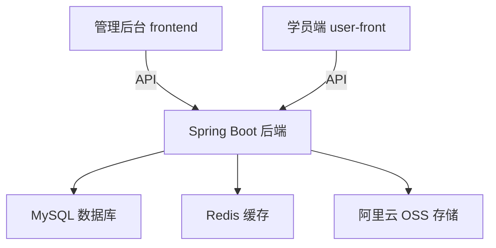

<div align="center">

# 🏥 护理培训管理系统

**Nursing Training Management System**

[](https://spring.io/projects/spring-boot)
[](https://vuejs.org/)
[](https://www.mysql.com/)
[]()

*赋能护理培训，提升专业技能*

</div>

---

## 📖 项目简介

本系统是一个面向护理培训场景的全流程管理平台，涵盖课程管理、PPT 课件、视频教学、文章发布、学员学习追踪等核心功能。采用前后端分离架构，支持管理后台与学员端双前端部署。

## 🏗️ 系统架构



## 📁 项目结构

| 目录 | 说明 | 技术栈 |
|------|------|--------|
| `src/` | 后端服务 | Spring Boot 7.0.8 + MyBatis-Plus |
| `frontend/` | 管理后台 | Vue 3 + Vite + Element Plus |
| `user-front/` | 学员端 | Vue 3 + Vite |

## ✨ 功能特性

### 📚 课程管理
- 课程创建、编辑、发布/下线
- 章节与课程点管理
- 课程封面上传
- 标签与分类关联

### 🎬 多媒体课件
- PPT 课件上传与管理
- 视频文件上传与转码
- 文件本地存储 / 阿里云 OSS 自适应

### 👥 用户与权限
- JWT 无状态认证
- 角色权限控制（管理员/讲师/学员）
- 学员学习进度追踪

### 📊 数据统计
- 课程概览统计
- PPT/视频/文章数据面板
- 学员学习日历与进度

## 🚀 快速开始

### 环境要求

- JDK 21+
- Node.js 18+
- MySQL 8.0+
- Redis（可选）

### 后端启动

```bash
# 1. 配置数据库（修改 application.yml 中的数据库连接信息）
# 2. 初始化数据库
mysql -u root -p < nursing3.0.sql

# 3. 启动后端
mvn spring-boot:run
```

后端默认运行在 `http://localhost:8080`

### 管理后台启动

```bash
cd frontend
npm install
npm run dev
```

访问 `http://localhost:5173`

### 学员端启动

```bash
cd user-front
npm install
npm run dev
```

访问 `http://localhost:5174`

## 🔧 配置说明

后端配置文件位于 `src/main/resources/application.yml`，支持通过环境变量覆盖：

| 环境变量 | 说明 | 默认值 |
|----------|------|--------|
| `DB_URL` | 数据库连接 | `jdbc:mysql://localhost:3306/nursing4.0` |
| `DB_USERNAME` | 数据库用户名 | `root` |
| `DB_PASSWORD` | 数据库密码 | `123456` |
| `JWT_SECRET` | JWT 密钥 | 内置默认值 |
| `ALIYUN_ACCESS_KEY_ID` | 阿里云 AccessKey | 空（使用本地存储） |

> 💡 **提示**：未配置阿里云 OSS 时，文件将自动保存到本地 `./uploads` 目录。

## 📸 项目截图

<!-- 在这里添加你的项目截图，格式如下 -->
<!-- 
| 管理后台 | 学员端 |
|:---:|:---:|
|  |  |
-->

> 📌 将截图放在 `docs/screenshots/` 目录下，取消上方注释即可显示

## 🛠️ 技术栈详情

<details>
<summary><b>后端</b></summary>

- **框架**: Spring Boot 7.0.8
- **ORM**: MyBatis-Plus
- **认证**: Spring Security + JWT
- **存储**: 阿里云 OSS SDK 3.18.2 / 本地文件存储
- **数据库**: MySQL 8.0
- **缓存**: Redis
</details>

<details>
<summary><b>前端</b></summary>

- **框架**: Vue 3 (Composition API)
- **构建工具**: Vite
- **UI 组件**: Element Plus
- **路由**: Vue Router 4
- **HTTP 客户端**: Axios
</details>

## 📝 开发计划

- [x] 用户认证与权限管理
- [x] 课程管理模块
- [x] PPT 课件管理
- [x] 视频管理
- [x] 文章管理
- [x] 文件上传（本地/OSS 双模式）
- [ ] 学员学习进度详细报表
- [ ] 移动端适配

## 🤝 贡献

欢迎提交 Issue 和 Pull Request！

## 📄 许可证

本项目采用 MIT 许可证

---

<div align="center">

**如果这个项目对你有帮助，请给一个 ⭐ Star 支持一下！**

</div>
